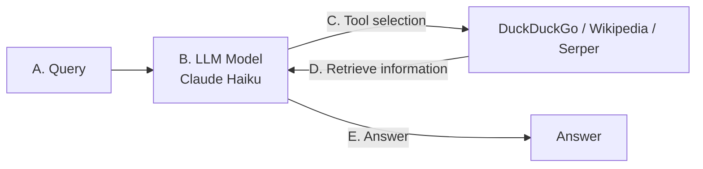

# ai-agents

A minimal search agent built on LangChain 1.x and Claude Haiku. The model receives a
query, selects among web search tools, retrieves results, and loops until it can answer.

## Architecture



The loop lives in `run()` in [main.py](main.py). Each streamed step is either a model
turn or a tool retrieval; it terminates when the model responds without requesting a tool.

## Setup

```powershell
python -m venv .venv
.\.venv\Scripts\Activate.ps1
pip install -r requirements.txt
```

Copy `.env.example` to `.env` and fill in your keys:

```
ANTHROPIC_API_KEY=sk-ant-...
SERPER_API_KEY=...
```

`.env` is gitignored. Never commit real keys — if one is exposed, rotate it immediately.

Get keys from [console.anthropic.com](https://console.anthropic.com) and
[serper.dev](https://serper.dev).

## Run

```powershell
python main.py
```

## Tools

| Tool                  | Source      | Requires key |
| --------------------- | ----------- | ------------ |
| `DuckDuckGoSearchRun` | `ddgs`      | No           |
| `WikipediaQueryRun`   | `wikipedia` | No           |
| `google_search`       | Serper API  | Yes          |

## Notes

- LangChain 1.x removed `initialize_agent` and `Tool`. Use `create_agent` and pass tool
  objects directly, or wrap plain functions with the `@tool` decorator.
- The `wikipedia` package sends a User-Agent that Wikimedia blocks, which surfaces as a
  `JSONDecodeError`. `main.py` calls `wikipedia.set_user_agent()` at startup to avoid it;
  replace the placeholder contact address with a real one.
